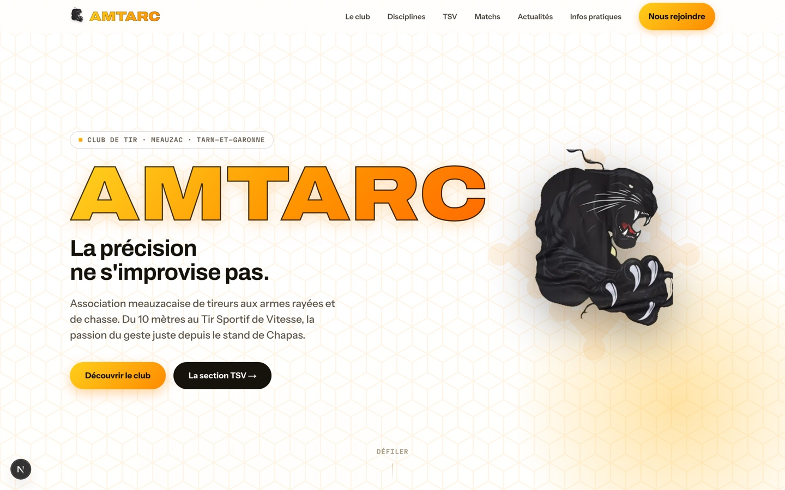

# AMTARC — website monorepo



Website for **AMTARC** (Association Meauzacaise de Tireurs aux Armes Rayées et de Chasse), a sports-shooting club in Meauzac (Tarn-et-Garonne, France).

Rebuilt from a Claude Design HTML prototype into a real, maintainable stack.

## Stack

- **`apps/web`** — Next.js 16 (App Router), TypeScript, Tailwind CSS v4, Motion (Framer Motion).
- **`apps/api`** — NestJS, TypeScript, Prisma + PostgreSQL, JWT auth.
- pnpm workspaces monorepo (no Turborepo/Nx — not needed at this scale).

The public site is statically generated with a 5-minute ISR safety net; the API pings a `/api/revalidate` webhook on every news write for near-instant updates without full rebuilds.

Admin authentication uses an httpOnly cookie held by a Next.js BFF proxy (`/api/admin/*`) that forwards requests to the API server-side — the JWT is never exposed to browser JavaScript. See [ADR 0001](docs/adr/0001-admin-auth-httponly-cookie-bff.md).

## Requirements

- Node.js 20+
- pnpm (`npm install -g pnpm`, or `corepack enable` on Node versions that still ship it)
- A local PostgreSQL instance (via `docker compose up -d`, or Homebrew/any local install — see note below)

## Getting started

```bash
pnpm install

# start Postgres (requires Docker Hub access)
docker compose up -d

# apps/api: create the schema and seed sample data
cp apps/api/.env.example apps/api/.env   # adjust DATABASE_URL etc. if needed
pnpm --filter api exec prisma migrate dev
pnpm --filter api exec prisma db seed

# apps/web: point at the local API
cp apps/web/.env.example apps/web/.env.local

# run both apps together
pnpm dev
```

- Web: http://localhost:3000
- API: http://localhost:3001
- Admin back-office (manage news without touching code): http://localhost:3000/admin/login — log in with `ADMIN_EMAIL`/`ADMIN_PASSWORD` from `apps/api/.env` (seeded on first `prisma db seed` run).

> **Note on local Postgres:** `docker compose up -d` is the intended way to run Postgres locally, but requires Docker Hub to be reachable. If Docker Hub isn't accessible from your machine/network, install PostgreSQL directly instead (e.g. `brew install postgresql@16 && brew services start postgresql@16`) and create a matching role/database (`amtarc`/`amtarc`) so `DATABASE_URL` in `apps/api/.env` resolves without changes.

## Scripts (repo root)

- `pnpm dev` — run `apps/web` and `apps/api` concurrently.
- `pnpm build` — production build both apps.
- `pnpm lint` — lint both apps.
- `pnpm typecheck` — type-check both apps without emitting.
- `pnpm test` — run every workspace test suite.
- `pnpm format` / `pnpm format:check` — Prettier over the whole repo.
- `pnpm db:migrate` / `pnpm db:seed` / `pnpm db:studio` — Prisma commands scoped to `apps/api`.

## Project structure

```
apps/
  web/    Next.js site (public pages, /matchs, /admin back-office, BFF auth proxy)
  api/    NestJS API (news, site content, uploads, matches, registrations, JWT auth)
docs/
  adr/    architecture decision records
.github/  CI (lint, tests, build), CodeQL, Dependabot
docker-compose.yml   local Postgres for development
```

## Development workflow

- `main` is protected and always deployable; day-to-day work happens on `develop` (or feature branches based on it) and reaches `main` through reviewed pull requests with green CI.
- Commit messages follow [Conventional Commits](https://www.conventionalcommits.org) (`feat:`, `fix:`, `test:`, `docs:`, …).

## Roadmap

Done:

- [x] Public site (Next.js, ISR + revalidation webhook)
- [x] News module: public listing + admin CRUD (NestJS, Prisma)
- [x] Admin auth hardening: httpOnly cookie via BFF proxy, middleware gating ([ADR 0001](docs/adr/0001-admin-auth-httponly-cookie-bff.md))
- [x] Test foundation: API unit + e2e (Jest), web (Vitest + Testing Library), coverage floor
- [x] CI (GitHub Actions), CodeQL, Dependabot; protected `main` + `develop` workflow
- [x] Admin panel v2: edit site content sections (hero, announcements, practical info, contact) and upload news images
- [x] Match booking system: match/squad catalog, online registration with "shoot with" wishes,
      wait-list with auto-promotion, bank-transfer tracking, transactional emails, auto-squadding
      proposal with an admin board, public squad rosters, and a CSV export for federation entry —
      see [docs/match-booking-plan.md](docs/match-booking-plan.md)

Planned:

- [ ] Switch transactional email to a real provider in production (`MAIL_DRIVER=resend` + API key;
      the log driver covers development)
- [ ] Continuous deployment once a hosting target is chosen (staging → production via GitHub Environments)
- [ ] Shared `packages/` workspace for API/web DTO types
- [ ] Raise the API coverage threshold as controller/guard tests land
- [ ] ESLint 10 — blocked upstream: `eslint-plugin-react` (pulled in by `eslint-config-next`) still
      calls APIs removed in ESLint 10, and ESLint 10's `no-useless-assignment` false-positives on
      NestJS decorator metadata. Revisit when `eslint-config-next` supports ESLint 10.
- [ ] TypeScript 7 — blocked upstream: TS 7.0 ships only the `tsc` binary, with no programmatic
      compiler API, so the Nest CLI cannot build. Microsoft expects the API back in 7.1; the repo
      runs TypeScript 6 in the meantime.

## License

© AMTARC. All rights reserved. The source is public for transparency; it is not licensed for reuse.
